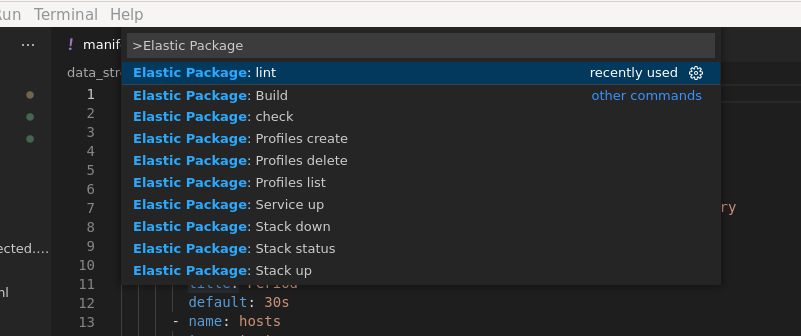
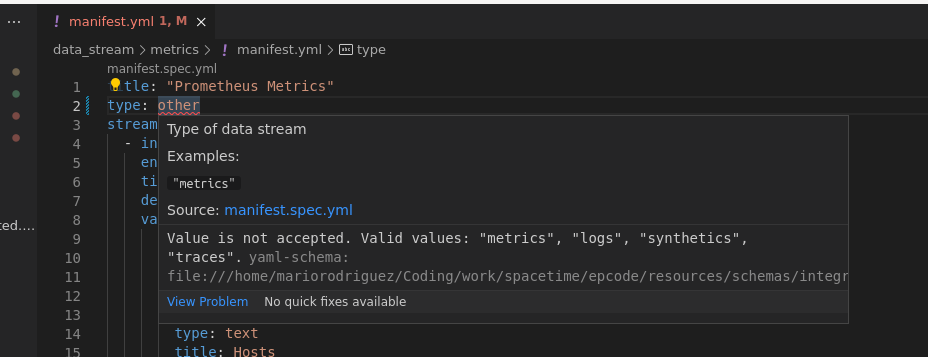

# elastic-package-code README

This `elastic-package-code` extension adds into Visual Studio Code features from [`elastic-package`](https://github.com/elastic/elastic-package) command to help develop and debug Elastic Packages.

Among those features, json and YAML validation as well as the option to trigger commands from the Command Pallete (e.g. building a package).

## Features

This extension adds the following actions into the Command Pallete:
- "Elastic Package: Lint": Run `elastic-package lint`
- "Elastic Package: Check": Run `elatic-package check`
- "Elastic Package: Build": Run `elastic-package build`
- "Elastic Package: Stack status": Run `elastic-package stack status`
- "Elastic Package: Stack up": Run `elastic-package stack up -d` 
    - When executing this command, several inputs are shown to gather more information:
        - version to be used to run the Elastic stack: parameter `--version`
        - services to start: parameter `--services`. By default, all services are started.
        - profile to use: paramtger `--profile`.
- "Elastic Package: Stack down": Run `elastic-package stack down`
- "Elastic Package: Service up": Run `elastic-package service up`
    - *Requirement*: The VS Code workspace should be a folder with the package definition.
    - **NOTE**: As this process is kept in the foreground, this command/action
     needs to be stopped by the developer in the terminal opened with `Ctrl+C`.
- "Elastic Package: Profiles list": Run `elastic-package profiles list`
- "Elastic Package: Profiles create": Run `elastic-package profiles create`
    - It allows to create a new profile based from an existing one: parameter `--from`.
- "Elastic Package: Profiles delete": Run `elastic-package profiles delete`

All these commands are triggered inside a new Terminal in VS Code.

Following the JSON schema, this extension also provides completion and validation of the files inside a package.
Example: 

## Requirements

### elastic-package command

This plugin requires that `elastic-package` command is installed in your system.
You can follow [these instructions](https://github.com/elastic/elastic-package#getting-started).

### YAML extension
In order to have YAML validation and completion it is required to install this extension:
- [YAML (Red Hat)](https://marketplace.visualstudio.com/items?itemName=redhat.vscode-yaml)

This extension adds the `yamlValidation` key under contributes so YAML schemas can be defined for specific files.

### Package context

Some of the commands require that the workspace in VS Code is a folder that contains the package defintions.
For instance "Elastic Package: Service up" command/action runs successfully if the current workspace in Code is
a folder with all the package files.

## Extension Settings

This extension contributes the following settings:

* `elastic-package-code.defaultProfile`: Default profile name to be used in `elastic-package` commands.

## Known Issues

## Release Notes

